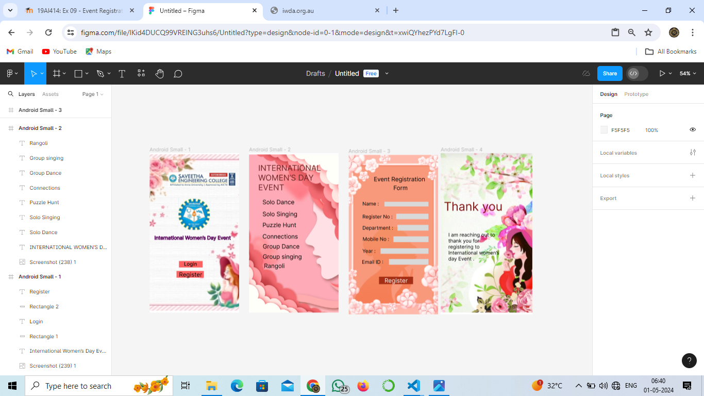

# Ex09 Event Registration Web Application
## Date:01.05.2024

## AIM:
To design, develop and deploy a web application for event registration.

## DESIGN STEPS:

### Step 1:
Create a new frame.

### Step 2:
Select any one preset size of your choice.

### Step 3:
Select the shapes you need.

### Step 4:
Import images as needed.

### Step 5:
Create pages based on your need and link them.

### Step 6:

Validate the HTML and CSS code.

### Step 6:

Publish the website in the given URL.

## DESIGN TOOL:
Figma

## CODE:
Page 1:
```
<div style="width: 360px; height: 640px; position: relative; background: white">
  
  
  <div style="width: 315px; height: 98px; left: 19px; top: 328px; position: absolute; color: rgba(0, 0, 0, 0.20); font-size: 20px; font-family: Inter; font-weight: 400; word-wrap: break-word">International Women’s Day Event </div>
  <div style="width: 95px; height: 26px; left: 118px; top: 433px; position: absolute; background: #FC6262"></div>
  <div style="width: 60px; height: 26px; left: 138px; top: 433px; position: absolute; color: black; font-size: 20px; font-family: Inter; font-weight: 500; word-wrap: break-word">Login</div>
  <div style="width: 110px; height: 27px; left: 108px; top: 473px; position: absolute; background: #FC6262"></div>
  <div style="width: 95px; height: 36px; left: 118px; top: 473px; position: absolute; color: black; font-size: 24px; font-family: Inter; font-weight: 400; word-wrap: break-word">Register</div>
</div>
```
Page 2:
```
<div style="width: 360px; height: 640px; position: relative; background: white">
  
  <div style="width: 289px; height: 73px; left: 37px; top: 40px; position: absolute; color: #6D2626; font-size: 32px; font-family: Inter; font-weight: 400; word-wrap: break-word">INTERNATIONAL WOMEN’S DAY EVENT</div>
  <div style="width: 160px; height: 37px; left: 54px; top: 182px; position: absolute; color: black; font-size: 24px; font-family: Inter; font-weight: 400; word-wrap: break-word">Solo Dance</div>
  <div style="width: 160px; height: 29px; left: 54px; top: 230px; position: absolute; color: black; font-size: 24px; font-family: Inter; font-weight: 400; word-wrap: break-word">Solo Singing</div>
  <div style="width: 179px; height: 29px; left: 54px; top: 274px; position: absolute; color: black; font-size: 24px; font-family: Inter; font-weight: 400; word-wrap: break-word">Puzzle Hunt</div>
  <div style="width: 147px; height: 29px; left: 54px; top: 320px; position: absolute; color: black; font-size: 24px; font-family: Inter; font-weight: 400; word-wrap: break-word">Connections</div>
  <div style="width: 178px; height: 29px; left: 55px; top: 360px; position: absolute; color: black; font-size: 24px; font-family: Inter; font-weight: 400; word-wrap: break-word">Group Dance</div>
  <div style="width: 159px; height: 37px; left: 55px; top: 401px; position: absolute; color: black; font-size: 24px; font-family: Inter; font-weight: 400; word-wrap: break-word">Group singing</div>
  <div style="width: 154px; height: 50px; left: 60px; top: 438px; position: absolute; color: black; font-size: 24px; font-family: Inter; font-weight: 400; word-wrap: break-word">Rangoli</div>
</div>
```
Page 3:
```
<div style="width: 360px; height: 640px; position: relative; background: white">
  
  <div style="width: 225px; height: 35px; left: 101px; top: 83px; position: absolute; color: black; font-size: 24px; font-family: Inter; font-weight: 400; word-wrap: break-word">Event Registration </div>
  <div style="width: 84px; height: 29px; left: 180px; top: 118px; position: absolute; color: black; font-size: 24px; font-family: Inter; font-weight: 400; word-wrap: break-word">Form</div>
  <div style="width: 106px; height: 23px; left: 55px; top: 184px; position: absolute; color: black; font-size: 20px; font-family: Inter; font-weight: 400; word-wrap: break-word">Name :</div>
  <div style="width: 132px; height: 23px; left: 55px; top: 236px; position: absolute; color: black; font-size: 20px; font-family: Inter; font-weight: 400; word-wrap: break-word">Register No :</div>
  <div style="width: 132px; height: 23px; left: 55px; top: 281px; position: absolute; color: black; font-size: 20px; font-family: Inter; font-weight: 400; word-wrap: break-word">Department :</div>
  <div style="width: 124px; height: 19px; left: 56px; top: 326px; position: absolute; color: black; font-size: 20px; font-family: Inter; font-weight: 400; word-wrap: break-word">Mobile No :</div>
  <div style="width: 106px; height: 23px; left: 55px; top: 374px; position: absolute; color: black; font-size: 20px; font-family: Inter; font-weight: 400; word-wrap: break-word">Year :</div>
  <div style="width: 108px; height: 23px; left: 53px; top: 418px; position: absolute; color: black; font-size: 20px; font-family: Inter; font-weight: 400; word-wrap: break-word">Email ID :</div>
  <div style="width: 177px; height: 19px; left: 144px; top: 188px; position: absolute; background: #D9D9D9"></div>
  <div style="width: 130px; height: 22px; left: 191px; top: 236px; position: absolute; background: #D9D9D9"></div>
  <div style="width: 125px; height: 23px; left: 196px; top: 281px; position: absolute; background: #D9D9D9"></div>
  <div style="width: 141px; height: 23px; left: 180px; top: 327px; position: absolute; background: #D9D9D9"></div>
  <div style="width: 193px; height: 22px; left: 128px; top: 375px; position: absolute; background: #D9D9D9"></div>
  <div style="width: 159px; height: 23px; left: 162px; top: 418px; position: absolute; background: #D9D9D9"></div>
  <div style="width: 137px; height: 30px; left: 122px; top: 489px; position: absolute; background: #A52F15"></div>
  <div style="width: 108px; height: 29px; left: 144px; top: 490px; position: absolute; color: white; font-size: 24px; font-family: Inter; font-weight: 400; word-wrap: break-word">Register</div>
</div>
```
Page 4:
```

```
## OUTPUT:


## RESULT:
The program to design, develop and deploy a web application for event registration is completed successfully.
